# Evidence - CDO Terraform Final Project

## Project Information

Project: **Deploy a Web App on AWS**

Architecture:

```text
VPC + Public/Private Subnets + EC2 + RDS MySQL + S3
```

State management:

```text
S3 backend + DynamoDB locking
```

Evidence folder:

```text
cloud/w8/CDO_Terraform/evidence/
```

## Evidence Summary

| No. | Evidence File | What It Proves |
| --- | --- | --- |
| 01 | `01-terraform-apply-output.png` | Terraform deployed the infrastructure successfully. |
| 02 | `02-web-browser-url.png` | The web app is accessible from the browser. |
| 03 | `03-vpc-created.png` | A dedicated VPC was created. |
| 04 | `04-subnets-public-private.png` | Public and private subnets were created. |
| 05 | `05-public-route-table-igw.png` | Public subnet has a route to the Internet Gateway. |
| 06 | `06-ec2-web-server.png` | EC2 web server is running in the public subnet. |
| 07 | `07-rds-mysql-private.png` | RDS MySQL is private and not publicly accessible. |
| 08 | `08-s3-assets-bucket-1.png` to `08-s3-assets-bucket-3.png` | S3 bucket exists and is configured for static assets. |
| 09 | `09-web-security-group.png` | Web Security Group allows only required inbound traffic. |
| 10 | `10-rds-security-group.png` | RDS Security Group only allows MySQL from the web server SG. |
| 11 | `11-backend-s3-dynamodb-1.png`, `11-backend-s3-dynamodb-2.png` | Terraform remote state backend and locking are configured. |
| 12 | `12-terraform-state-list.png` | Terraform manages the created AWS resources. |
| 13 | `13-terraform-validate.png` | Terraform configuration is valid. |

## 1. Terraform Apply / Output

Evidence file:

```text
evidence/01-terraform-apply-output.png
```

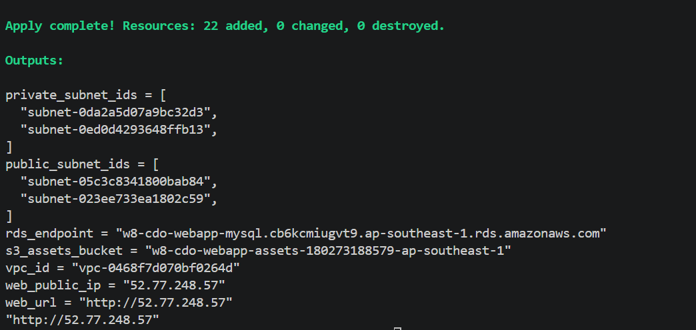

This screenshot proves that Terraform was able to deploy the infrastructure and return the required outputs, such as the web URL, EC2 public IP, RDS endpoint, S3 bucket, VPC ID, and subnet IDs.

## 2. Web App Accessible From Browser

Evidence file:

```text
evidence/02-web-browser-url.png
```

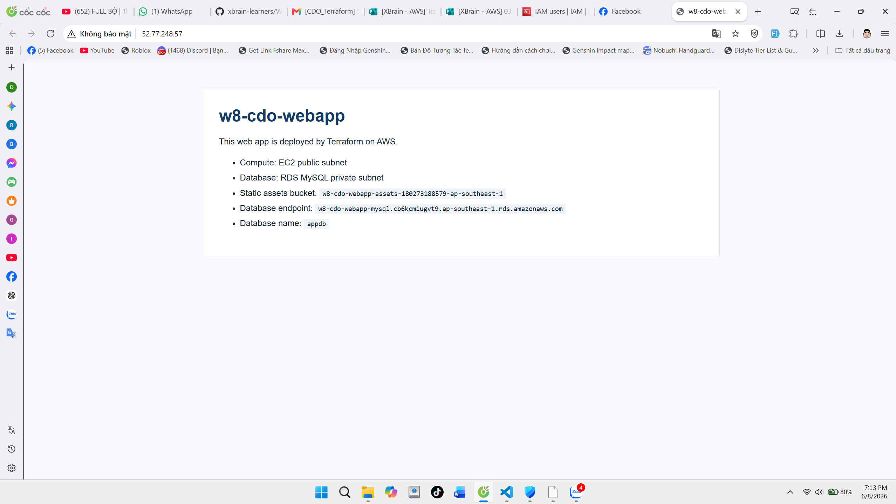

This screenshot proves that the EC2 web server is reachable through HTTP and the web application is successfully served by Nginx.

## 3. VPC Created

Evidence file:

```text
evidence/03-vpc-created.png
```

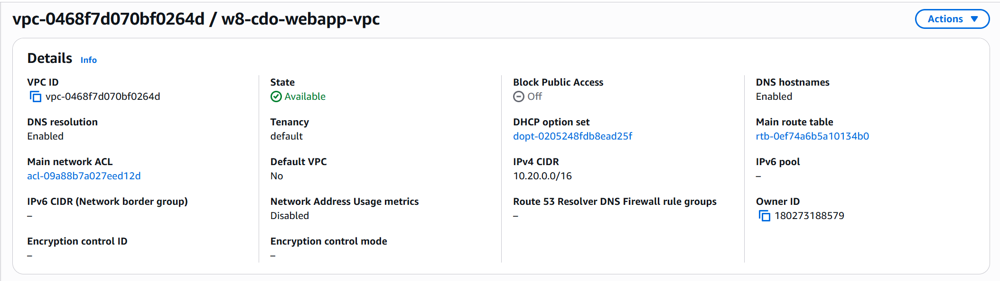

This screenshot proves that the project has its own VPC. The VPC is the network boundary for the web server, database, public subnets, and private subnets.

## 4. Public And Private Subnets

Evidence file:

```text
evidence/04-subnets-public-private.png
```


This screenshot proves that the VPC contains both public and private subnets. The public subnet is used for the EC2 web server, while the private subnets are used for RDS MySQL.

## 5. Public Route Table And Internet Gateway

Evidence file:

```text
evidence/05-public-route-table-igw.png
```

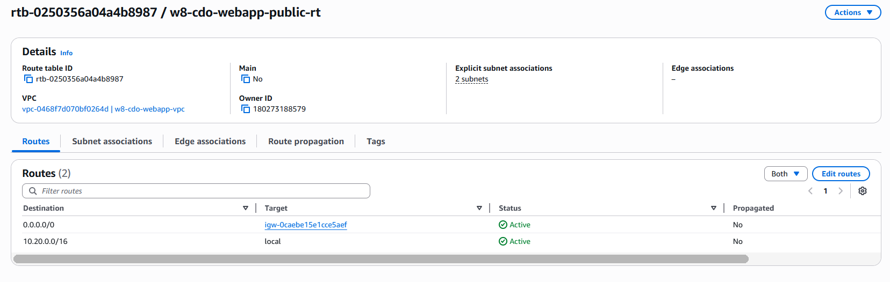

This screenshot proves that the public route table has a default route to the Internet Gateway. This is required so resources in the public subnet can receive and send Internet traffic.

## 6. EC2 Web Server

Evidence file:

```text
evidence/06-ec2-web-server.png
```

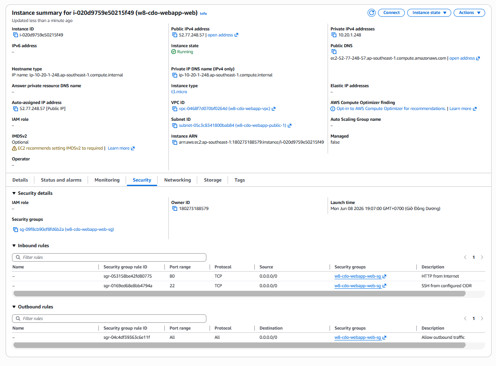

This screenshot proves that the EC2 instance for the web server is running. The EC2 instance is placed in a public subnet and has a public IPv4 address so users can access the website.

## 7. RDS MySQL In Private Subnet

Evidence file:

```text
evidence/07-rds-mysql-private.png
```

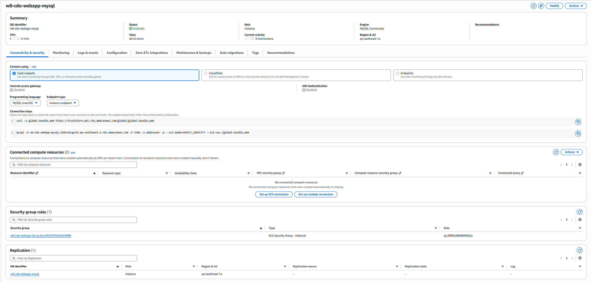

This screenshot proves that the MySQL database is deployed using Amazon RDS. The database is not publicly accessible and is protected inside the private network.

## 8. S3 Bucket For Static Assets

Evidence files:

```text
evidence/08-s3-assets-bucket-1.png
evidence/08-s3-assets-bucket-2.png
evidence/08-s3-assets-bucket-3.png
```

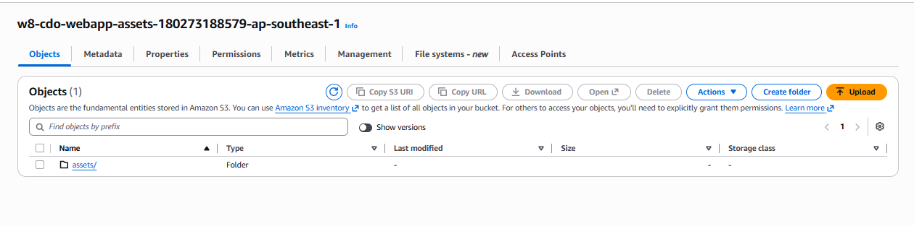

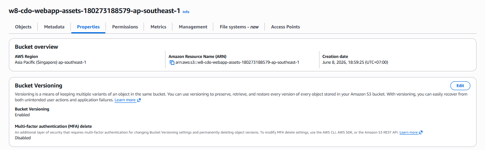

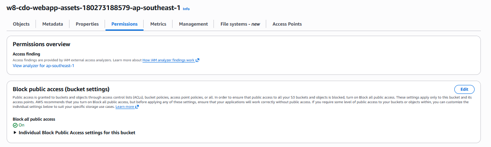

These screenshots prove that the S3 bucket for static assets was created. The bucket is used to store static files and is configured with basic security settings such as public access blocking, versioning, and server-side encryption.

## 9. Web Security Group

Evidence file:

```text
evidence/09-web-security-group.png
```

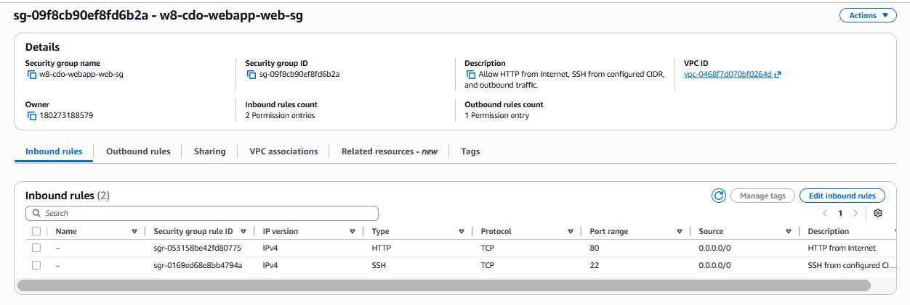

This screenshot proves that the web server Security Group allows only the required inbound traffic:

- HTTP port `80` for users to access the web app.
- SSH port `22` for administration, controlled by the configured SSH CIDR.

## 10. RDS Security Group

Evidence file:

```text
evidence/10-rds-security-group.png
```

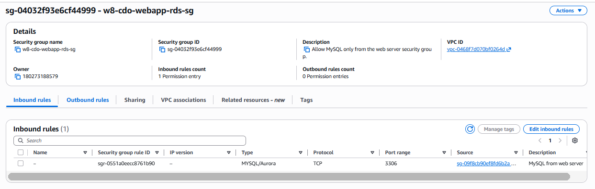

This screenshot proves that the RDS Security Group only allows MySQL traffic on port `3306` from the EC2 web server Security Group. It does not expose the database directly to the Internet.

## 11. Terraform Backend: S3 And DynamoDB Locking

Evidence files:

```text
evidence/11-backend-s3-dynamodb-1.png
evidence/11-backend-s3-dynamodb-2.png
```

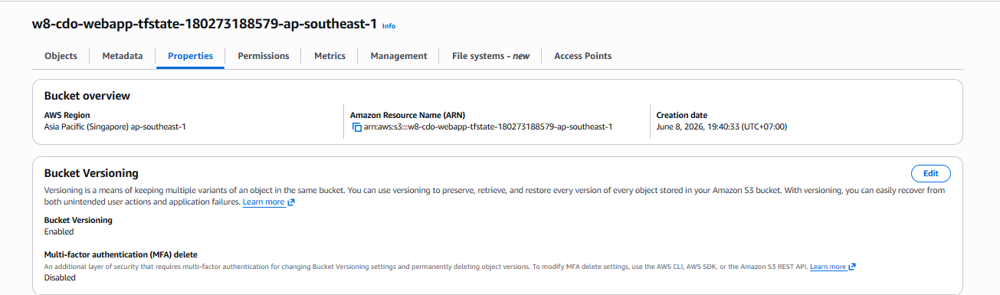

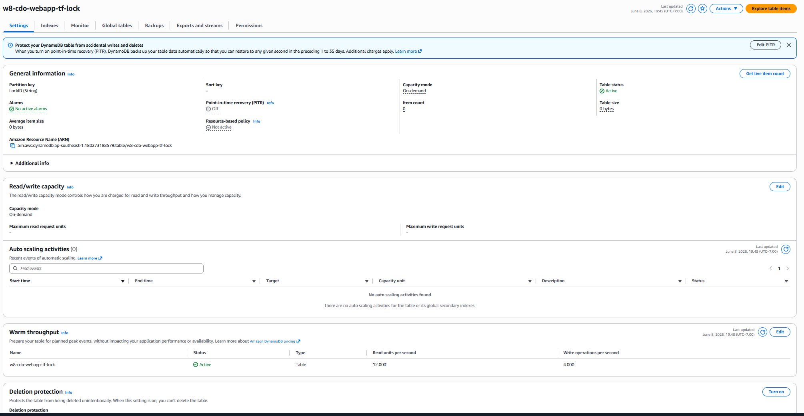

These screenshots prove that Terraform remote state is stored in an S3 bucket and protected with DynamoDB locking.

Backend resources:

```text
S3 bucket: w8-cdo-webapp-tfstate-180273188579-ap-southeast-1
DynamoDB table: w8-cdo-webapp-tf-lock
```

This setup is important because the Terraform state is no longer stored only on the local machine. DynamoDB locking also prevents multiple users from modifying the same infrastructure state at the same time.

## 12. Terraform State List

Evidence file:

```text
evidence/12-terraform-state-list.png
```

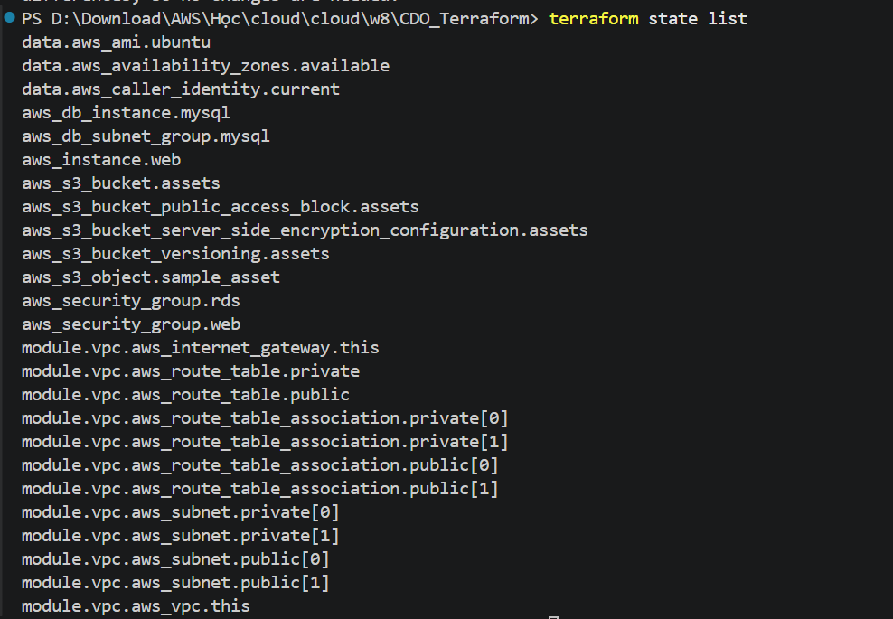

This screenshot proves that Terraform is managing the AWS resources in its state, including VPC, subnets, EC2, RDS, S3, Security Groups, and backend-related resources.

## 13. Terraform Validate

Evidence file:

```text
evidence/13-terraform-validate.png
```

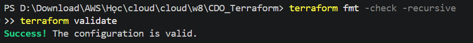

This screenshot proves that the Terraform configuration is syntactically valid and ready to be used.

## Final Checklist

- [x] VPC created.
- [x] Public and private subnets created.
- [x] EC2 web server deployed in public subnet.
- [x] RDS MySQL deployed privately.
- [x] S3 bucket created for static assets.
- [x] Security Groups configured with least required traffic.
- [x] Terraform state stored in S3 backend.
- [x] DynamoDB locking configured.
- [x] Web application accessible from browser.
- [x] Terraform state and validation captured.

## Short Explanation For Report

This project deploys a simple web application on AWS using Terraform. The infrastructure uses a dedicated VPC with public and private subnets. The EC2 instance runs the web server in the public subnet, while RDS MySQL is deployed privately and only accepts traffic from the web server Security Group. S3 is used to store static assets. Terraform state is stored in an S3 backend with DynamoDB locking, which improves collaboration and prevents concurrent state modification.
