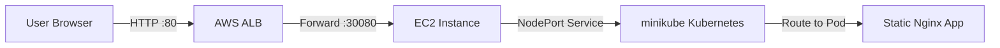
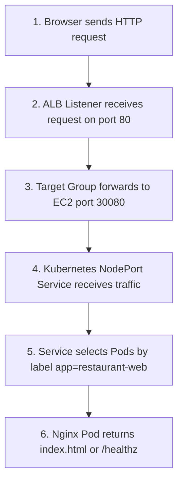
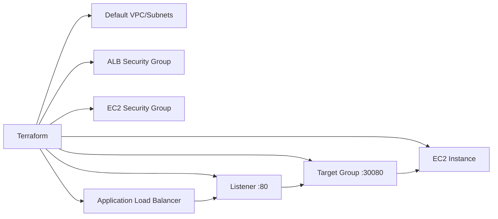
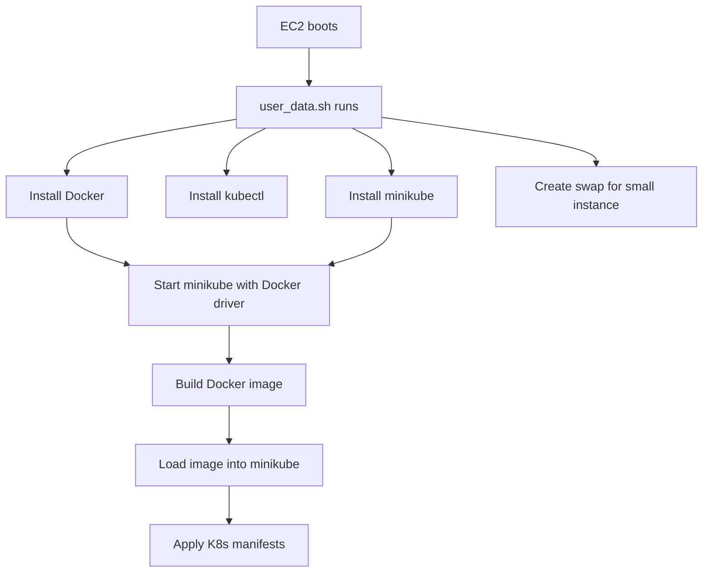
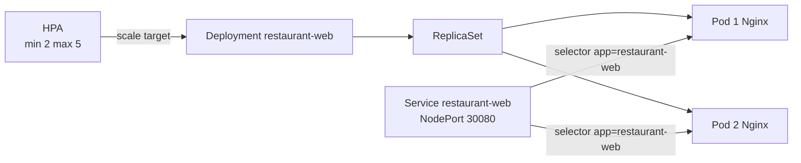
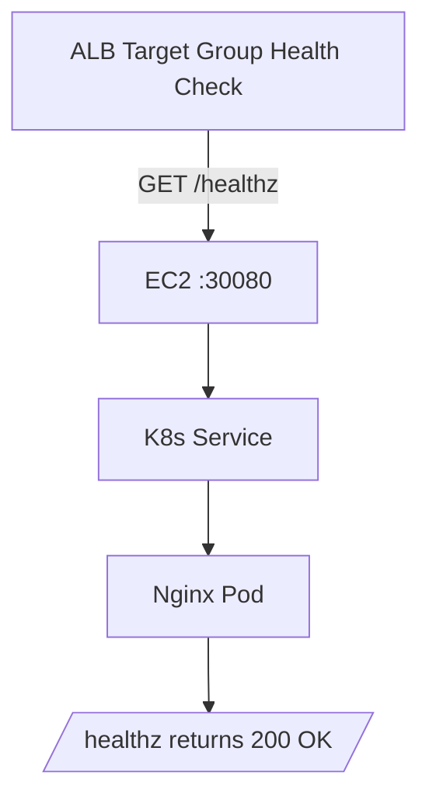
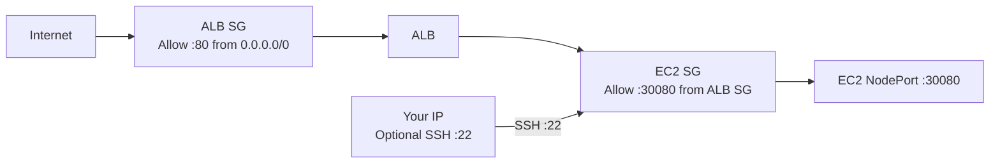
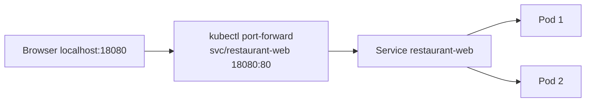

# Architecture Diagram - W8 K8s on AWS Challenge

File này tách kiến trúc thành nhiều flow nhỏ để dễ học và dễ vấn đáp.

---

## 1. Big Picture



Giải thích ngắn:

- User chỉ biết ALB DNS.
- ALB forward traffic vào EC2 port `30080`.
- Port `30080` là Kubernetes NodePort.
- Service route traffic tới Pod chạy Nginx app.

---

## 2. Request Flow



Câu nói vấn đáp:

```text
Request đi từ Browser vào ALB port 80, ALB listener forward sang Target Group,
Target Group gọi EC2 port 30080, đây là NodePort của Kubernetes Service,
rồi Service route tới Pod có label app=restaurant-web.
```

---

## 3. AWS Infrastructure Flow



Giải thích ngắn:

- Terraform không chỉ tạo EC2.
- Terraform tạo cả ALB, Target Group, Listener và Security Groups.
- Target Group dùng port `30080` vì app được expose bằng NodePort.

---

## 4. EC2 Bootstrap Flow



Câu nói vấn đáp:

```text
EC2 không được cấu hình thủ công. Terraform truyền user_data để EC2 tự cài Docker,
kubectl, minikube, build image, load image vào minikube và apply manifest.
```

---

## 5. Kubernetes Runtime Flow



Giải thích ngắn:

- Deployment quản lý ReplicaSet.
- ReplicaSet giữ đúng số Pod.
- Service không gọi Pod theo IP cố định, mà chọn Pod bằng label.
- HPA scale Deployment khi metrics vượt ngưỡng.

---

## 6. Health Check Flow



Giải thích ngắn:

- ALB health check gọi `/healthz`.
- Nginx trả `200 OK`.
- Nếu health check fail, Target Group xem EC2 target unhealthy.

---

## 7. Security Group Flow



Giải thích ngắn:

- Internet chỉ vào ALB port 80.
- EC2 NodePort `30080` chỉ nhận traffic từ ALB Security Group.
- SSH chỉ để debug, nên tốt nhất giới hạn bằng IP cá nhân `/32`.

---

## 8. Local Test Flow



Giải thích ngắn:

- Local không có ALB.
- Dùng `kubectl port-forward` để test Service.
- Evidence local đã có: `/healthz` và `/` đều trả HTTP 200.

---

## 9. One-Minute Explanation

```text
Terraform tạo hạ tầng AWS gồm ALB, Target Group, Security Groups và EC2.
EC2 dùng user_data để tự cài Docker, kubectl, minikube và deploy app vào Kubernetes.
App không chạy trực tiếp trên EC2 mà chạy trong Pod do Deployment quản lý.
Service type NodePort expose app ra port 30080 trên EC2.
ALB nhận traffic Internet port 80 rồi forward vào EC2 port 30080.
Health check dùng /healthz để xác nhận app healthy.
```
