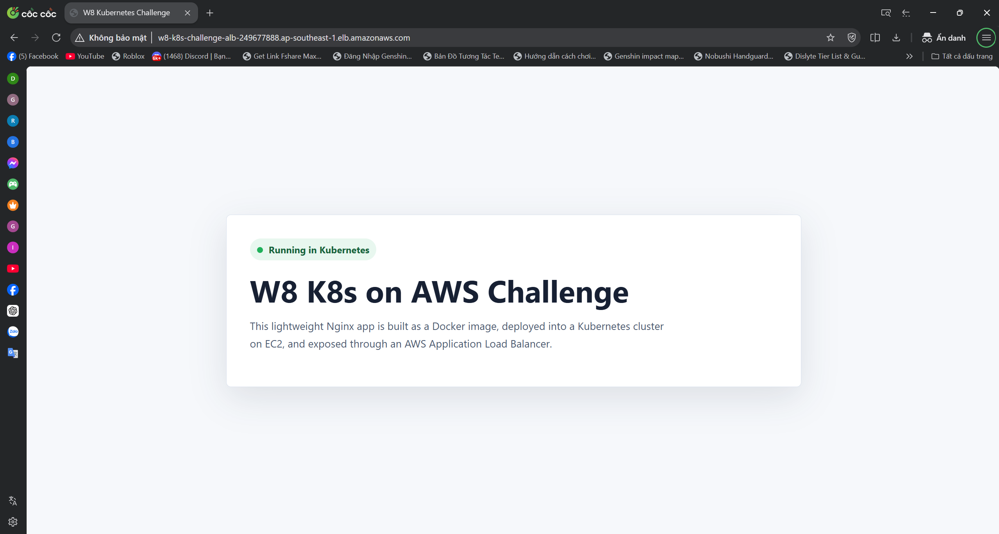
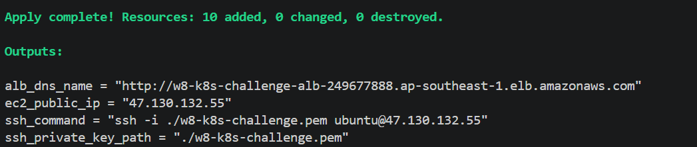
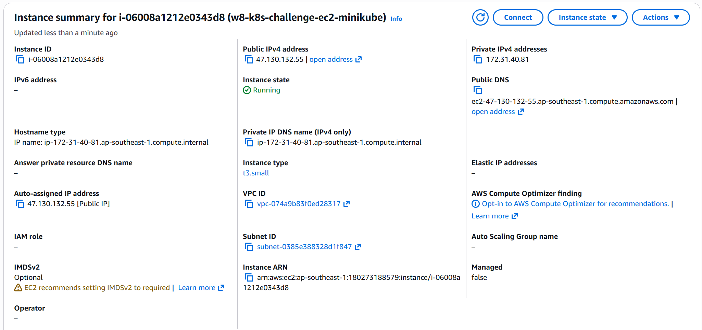
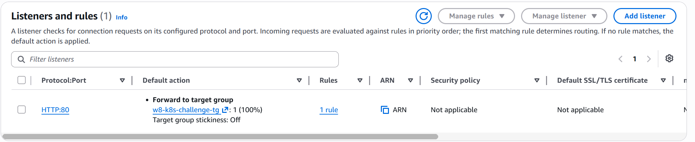
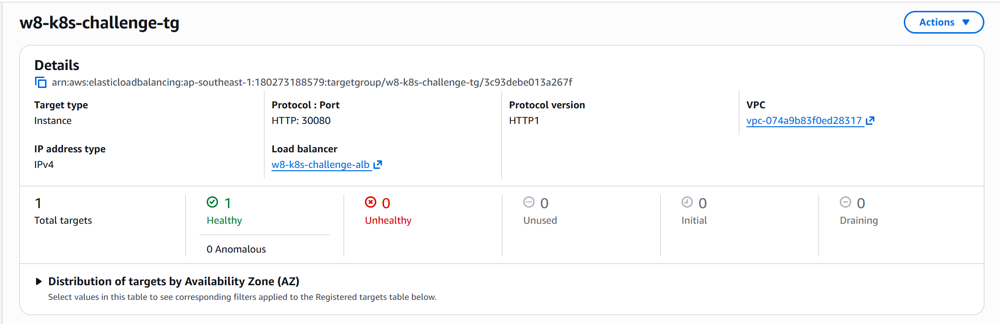
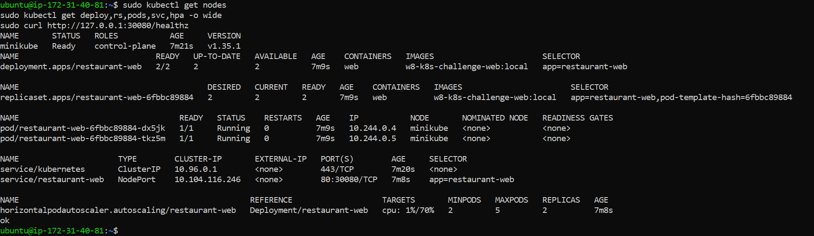
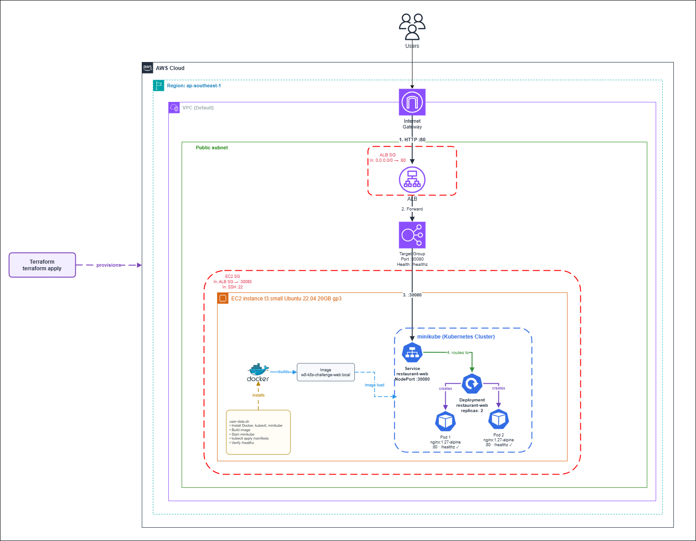

# Evidence - W8 Kubernetes on AWS Terraform 1-Click Deploy

This file collects the screenshots and verification notes for the W8 challenge.

## Evidence Folder

Screenshots are stored in this repository at:

```text
cloud/w8/lab/challenge/evidence/
```

Original local screenshot folder:

```text
C:\Users\NITRO\OneDrive\Hình ảnh\Screenshots\05062026
```

## Submitted Screenshots

| Evidence | Screenshot | What it proves |
| --- | --- | --- |
| Web through ALB | [Web.png](evidence/Web.png) | The application is publicly accessible through the ALB DNS. |
| Terraform apply | [Terraform_apply.png](evidence/Terraform_apply.png) | Terraform successfully created the AWS infrastructure. |
| EC2 instance | [EC2_instance.png](evidence/EC2_instance.png) | The EC2 instance is running and is the backend node for the challenge. |
| ALB listener | [Listeners.png](evidence/Listeners.png) | The ALB has an HTTP listener forwarding traffic to the Target Group. |
| Target Group health | [TargetGroup.png](evidence/TargetGroup.png) | The EC2 target is healthy on port `30080`. |
| Kubernetes workload | [Kubernetes_workload_EC2.png](evidence/Kubernetes_workload_EC2.png) | Deployment, ReplicaSet, Pods, Service, and HPA are running in Kubernetes. |
| Architecture diagram | [aws-k8s-challenge-Trang-2.drawio.png](evidence/aws-k8s-challenge-Trang-2.drawio.png) | Shows the target architecture and request flow. |

## Screenshot Preview

### Web through ALB



### Terraform Apply



### EC2 Instance



### ALB Listener



### Target Group Health



### Kubernetes Workload



### Architecture Diagram



## Architecture Summary

```text
User Browser
  -> Application Load Balancer HTTP :80
  -> Target Group
  -> EC2 :30080
  -> minikube Service NodePort
  -> Deployment
  -> Nginx Pods :80
```

## Verification Checklist

- [x] Terraform creates AWS infrastructure.
- [x] EC2 instance is running.
- [x] ALB has HTTP listener on port `80`.
- [x] Target Group forwards to EC2 port `30080`.
- [x] Target Group health check returns healthy.
- [x] Kubernetes Deployment is running with 2 replicas.
- [x] Kubernetes Service exposes NodePort `30080`.
- [x] HPA exists for `restaurant-web`.
- [x] Web app is accessible through ALB DNS.
- [x] Architecture diagram is included.

## Useful Verification Commands

Terraform outputs:

```powershell
cd D:\Download\AWS\Học\cloud\cloud\w8\lab\challenge\terraform
terraform output
```

Check ALB Target Group health:

```powershell
aws elbv2 describe-target-health `
  --target-group-arn <target-group-arn> `
  --region ap-southeast-1
```

SSH into EC2:

```powershell
ssh -i .\w8-k8s-challenge.pem ubuntu@<ec2-public-ip>
```

Check Kubernetes workload from EC2:

```bash
sudo kubectl get nodes
sudo kubectl get deploy,rs,pods,svc,hpa -o wide
sudo curl http://127.0.0.1:30080/healthz
sudo cat /opt/w8-challenge/evidence.txt
```

Expected health check response:

```text
ok
```

## Short Presentation Notes

This challenge demonstrates a 1-click deployment flow. Terraform provisions the AWS resources, including EC2, ALB, Target Group, Listener, Security Groups, and Key Pair. After EC2 starts, `user-data.sh` installs Docker, kubectl, and minikube, builds the Nginx web image, loads it into minikube, and applies the Kubernetes Deployment, Service, and HPA.

The public request flow is:

```text
ALB :80 -> EC2 :30080 -> Kubernetes Service -> Nginx Pod :80
```

The `/healthz` endpoint is used by both the ALB Target Group and Kubernetes probes to verify that the app is healthy.
