# Evidence - W9 Day C: AWS Monitoring Alerts

## Thông Tin Chung

Bài lab triển khai 2 cơ chế cảnh báo trên AWS:

1. **EC2 CPU Alarm -> SNS Email Alert**
2. **AWS Root Account Login Alert -> SNS Email Alert**

Thư mục ảnh bằng chứng:

```text
cloud/w9/day-c/evidence/
```

## Tóm Tắt Kết Quả

| Hạng mục | Trạng thái |
| --- | --- |
| EC2 monitoring instance | Hoàn thành |
| CloudWatch Agent trên EC2 | Hoàn thành |
| SNS Topic và Email Subscription | Hoàn thành |
| CPU Alarm gửi email khi CPU vượt 80% | Hoàn thành |
| CloudTrail ghi log AWS account | Hoàn thành |
| Metric Filter phát hiện root account login | Hoàn thành |
| Root Login Alarm gửi cảnh báo qua SNS | Hoàn thành |

## Danh Sách Evidence

| STT | File ảnh | Nội dung chứng minh |
| --- | --- | --- |
| 1 | `ec2-running.png` | EC2 instance dùng cho monitoring đang chạy |
| 2 | `iam-role.png` | EC2 có IAM Role cần thiết cho CloudWatch Agent |
| 3 | `cloudwatch-agent-status.png` | CloudWatch Agent đã cài và đang chạy |
| 4 | `sns-topic.png` | SNS Topic đã được tạo |
| 5 | `sns-email-confirmed.png` | Email subscription đã được xác nhận |
| 6 | `cloudwatch-alarm-config.png` | CPU Alarm được cấu hình đúng |
| 7 | `cpu-stress-running.png` | Đã chạy stress CPU để test alarm |
| 8 | `alarm-in-alarm.png` | CPU Alarm chuyển sang trạng thái `In alarm` |
| 9 | `email-alert-received.png` | Email cảnh báo CPU đã được gửi về email |
| 10 | `root-cloudtrail-trail.png` | CloudTrail trail cho root login alert đã bật |
| 11 | `root-cloudwatch-log-group.png` | CloudTrail gửi log vào CloudWatch Logs |
| 12 | `root-metric-filter.png` | Metric Filter bắt sự kiện root account login |
| 13 | `root-security-metric.png` | Metric `RootAccountLoginCount` đã được tạo |
| 14 | `root-login-alarm-config.png` | Root Login Alarm được cấu hình đúng |
| 15 | `root-login-alarm-sns-action.png` | Root Login Alarm gửi notification qua SNS |

## Evidence Chi Tiết

### 1. EC2 Instance Đang Running

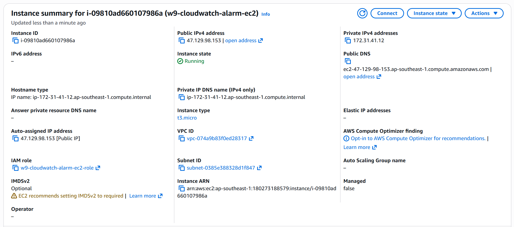

Bằng chứng này cho thấy EC2 instance `w9-cloudwatch-alarm-ec2` đã được tạo và đang ở trạng thái `Running`.

### 2. IAM Role Cho EC2

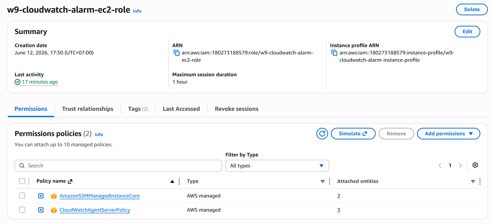

Bằng chứng này cho thấy EC2 đã được gắn IAM Role để CloudWatch Agent có quyền gửi metric về CloudWatch.

Các quyền chính:

- `CloudWatchAgentServerPolicy`
- `AmazonSSMManagedInstanceCore`

### 3. CloudWatch Agent Đang Chạy

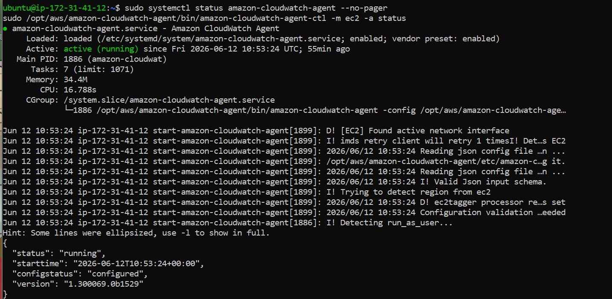

Bằng chứng này cho thấy CloudWatch Agent đã được cài đặt và đang hoạt động trên EC2.

Kết quả cần thể hiện:

- Agent status: `running`
- Config status: `configured`

### 4. SNS Topic

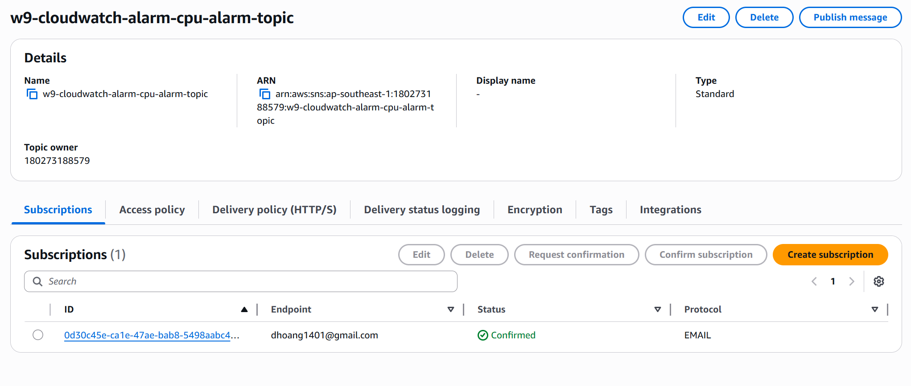

Bằng chứng này cho thấy SNS Topic đã được tạo để nhận notification từ CloudWatch Alarm.

Topic:

```text
w9-cloudwatch-alarm-cpu-alarm-topic
```

### 5. SNS Email Subscription Confirmed

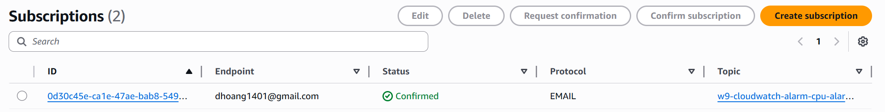

Bằng chứng này cho thấy email nhận cảnh báo đã xác nhận subscription thành công.

Trạng thái cần có:

```text
Confirmed
```

### 6. CloudWatch CPU Alarm Config

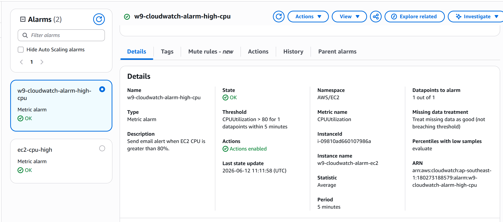

Bằng chứng này cho thấy CPU Alarm được cấu hình theo yêu cầu:

- Metric: `CPUUtilization`
- Namespace: `AWS/EC2`
- Threshold: CPU lớn hơn `80%`
- Action: gửi cảnh báo đến SNS Topic

### 7. CPU Stress Test

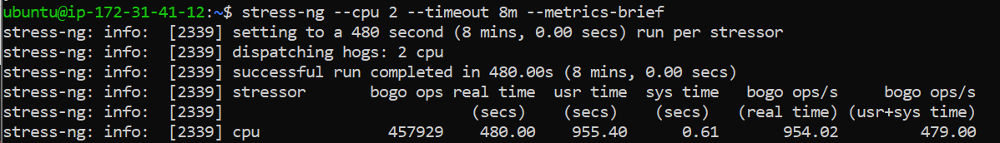

Bằng chứng này cho thấy EC2 đã được tạo tải CPU để kiểm tra alarm.

Lệnh test:

```bash
stress-ng --cpu 2 --timeout 8m --metrics-brief
```

### 8. CPU Alarm In Alarm

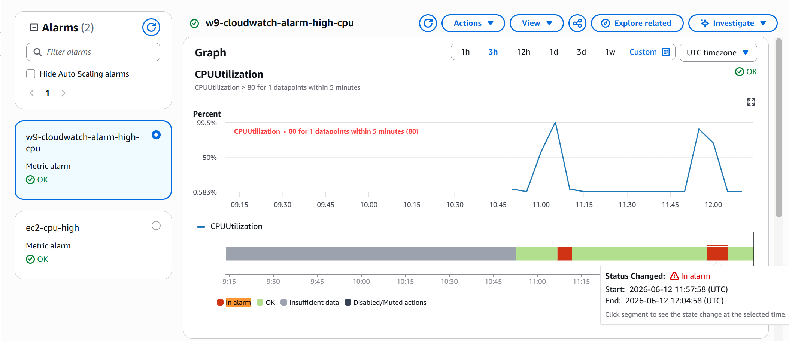

Bằng chứng này cho thấy CPU Alarm đã chuyển sang trạng thái `In alarm` sau khi CPU vượt ngưỡng.

### 9. Email Alert Received

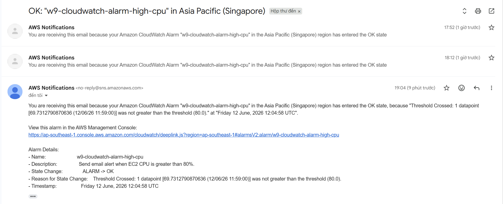

Bằng chứng này cho thấy SNS đã gửi email cảnh báo thành công khi CPU Alarm được kích hoạt.

## Root Account Login Alert Evidence

### 10. CloudTrail Trail

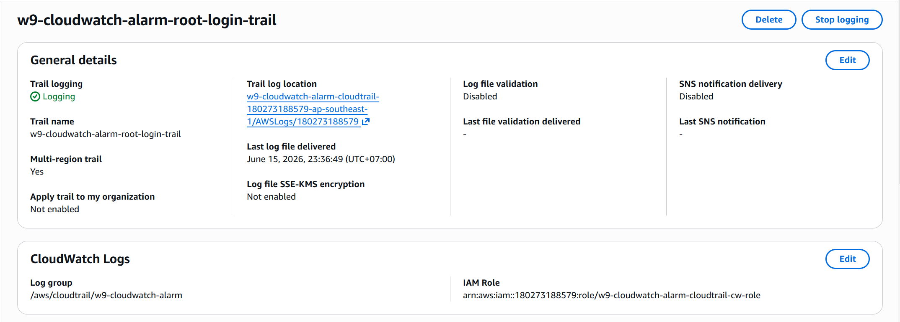

Bằng chứng này cho thấy CloudTrail trail `w9-cloudwatch-alarm-root-login-trail` đã được tạo và bật logging.

CloudTrail là nguồn ghi lại hoạt động trong AWS account, bao gồm sự kiện root account login.

### 11. CloudWatch Log Group

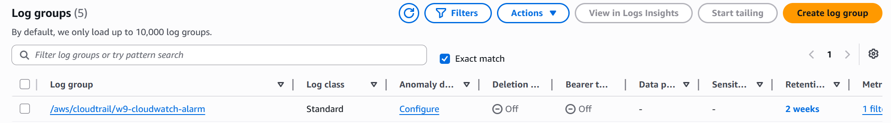

Bằng chứng này cho thấy CloudTrail gửi log vào CloudWatch Logs.

Log group:

```text
/aws/cloudtrail/w9-cloudwatch-alarm
```

### 12. Metric Filter Root Login

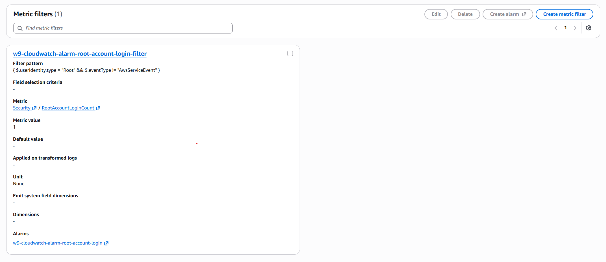

Bằng chứng này cho thấy Metric Filter đã được tạo để phát hiện root account login.

Metric filter:

```text
w9-cloudwatch-alarm-root-account-login-filter
```

Filter pattern:

```text
{ $.userIdentity.type = "Root" && $.eventType != "AwsServiceEvent" }
```

### 13. Security Metric

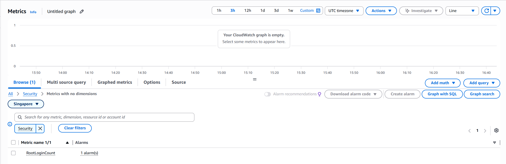

Bằng chứng này cho thấy metric `RootAccountLoginCount` đã xuất hiện trong namespace `Security`.

Metric này tăng khi có sự kiện root account login khớp với Metric Filter.

### 14. Root Login Alarm Config

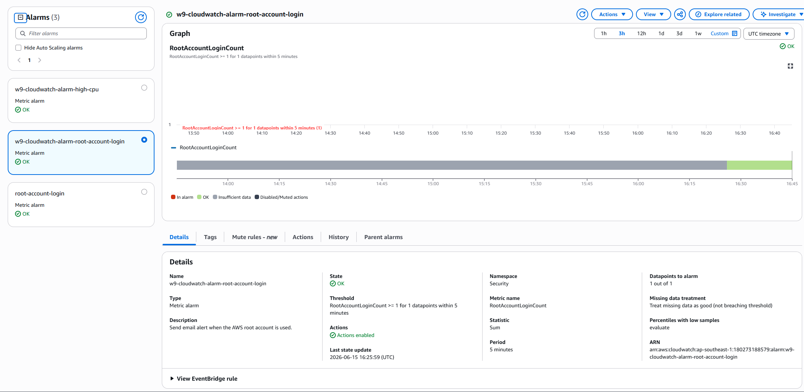

Bằng chứng này cho thấy CloudWatch Alarm cho root account login đã được cấu hình.

Cấu hình chính:

- Metric: `RootAccountLoginCount`
- Namespace: `Security`
- Statistic: `Sum`
- Threshold: `>= 1`
- Period: `5 minutes`

Chỉ cần một lần root account login trong kỳ đánh giá là alarm có thể kích hoạt.

### 15. Root Login Alarm SNS Action

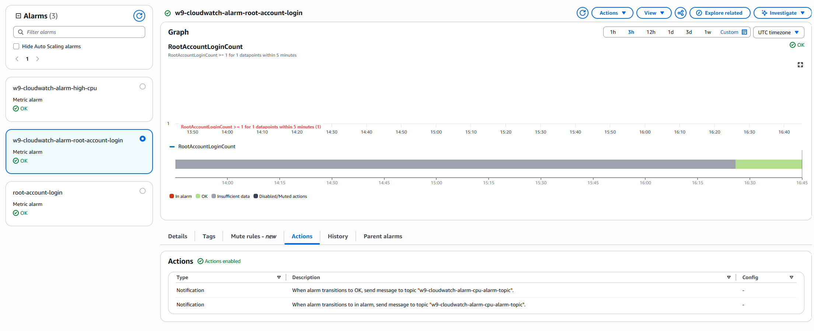

Bằng chứng này cho thấy Root Login Alarm có action gửi notification đến SNS Topic.

SNS Topic sau đó gửi cảnh báo về email đã subscribe.

## Luồng Hoạt Động

### CPU Alarm

```text
EC2 CPU vượt ngưỡng
-> CloudWatch Alarm chuyển ALARM
-> Alarm gửi notification đến SNS Topic
-> SNS gửi email cảnh báo
```

### Root Account Login Alert

```text
Root account login
-> CloudTrail ghi event
-> CloudWatch Logs nhận event
-> Metric Filter tạo metric RootAccountLoginCount
-> CloudWatch Alarm chuyển ALARM
-> Alarm gửi notification đến SNS Topic
-> SNS gửi email cảnh báo
```

## Kết Luận

Bài W9 Day C đã hoàn thành các yêu cầu chính:

- Cài và kiểm tra CloudWatch Agent trên EC2.
- Tạo CPU Alarm và gửi cảnh báo qua SNS email.
- Tạo CloudTrail để ghi nhận sự kiện trong AWS account.
- Tạo Metric Filter để phát hiện root account login.
- Tạo Root Login Alarm và gửi cảnh báo qua SNS email.

## Cleanup

Sau khi nộp bài, xóa tài nguyên để tránh phát sinh chi phí:

```powershell
cd D:\Download\AWS\Học\cloud\cloud\w9\day-c\terraform
terraform destroy
```
