# W9 Evidence - GitOps, Observability, Canary, and Alerting

This document records the evidence for the W9 lab and the "Ship Smartly" challenge.

## Project Result

| Requirement | Status | Evidence |
| --- | --- | --- |
| GitOps deployment with ArgoCD | Passed | ArgoCD manages `root`, `web`, `kube-prometheus-stack`, and `argo-rollouts` |
| Prometheus/Grafana/Alertmanager installed by GitOps | Passed | Monitoring pods are running |
| Argo Rollouts installed by GitOps | Passed | Rollouts controller pods are running |
| Application exposes metrics | Passed | Backend exposes `/metrics` |
| Prometheus scrapes application metrics | Passed | Prometheus query returns backend metrics |
| SLO alert exists | Passed | `BackendHighErrorRate` rule is visible in Prometheus |
| Alert fires and sends email | Passed | Prometheus alert is firing and email is received |
| Good canary release succeeds | Passed | AnalysisRuns are successful and rollout becomes healthy |
| Bad canary release auto-aborts | Passed | AnalysisRun fails and rollout is aborted |
| Rollback is done through Git | Passed | `git revert` evidence is captured |
| Final application state restored | Passed | Backend was restored to `ERROR_RATE=0`, and ArgoCD returned to `Synced / Healthy` |

## Evidence Files

All screenshots are stored in:

```text
cloud/w9/lab/evidence/
```

## 1. ArgoCD Applications

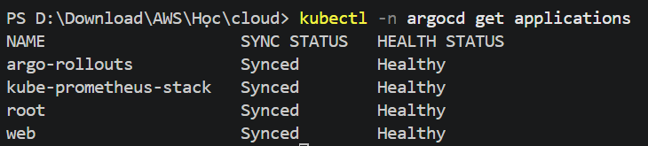

This screenshot proves that ArgoCD is managing the required applications:

- `root`
- `web`
- `kube-prometheus-stack`
- `argo-rollouts`

The `root` application follows the app-of-apps pattern and creates the child applications from `argocd/apps`.

## 2. Monitoring Stack Running


This screenshot proves that the monitoring stack is running in the `monitoring` namespace.

Expected components:

- Alertmanager
- Grafana
- Prometheus
- Prometheus Operator
- kube-state-metrics
- node-exporter

## 3. Argo Rollouts Controller Running


This screenshot proves that the Argo Rollouts controller is running.

The controller is required to process:

- `Rollout`
- `AnalysisTemplate`
- `AnalysisRun`

## 4. Demo Namespace Resources


This screenshot proves that the `demo` namespace contains the core resources required by the challenge:

- `Rollout/backend`
- `Rollout/frontend`
- `Service/backend`
- `Service/frontend`
- `ServiceMonitor/backend`
- `PrometheusRule/backend-slo-alerts`
- `AnalysisTemplate/backend-error-rate`
- backend/frontend pods

## 5. Web Application Running

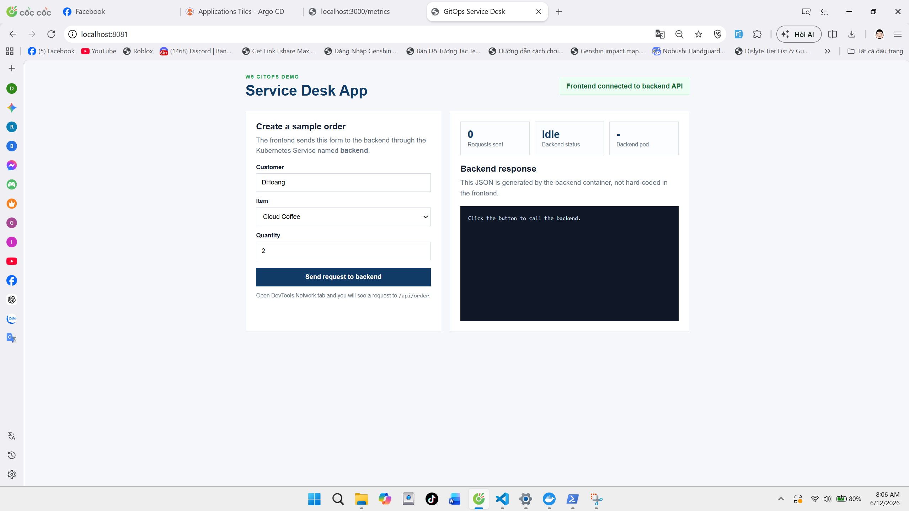

This screenshot proves that the demo web application is reachable and can call the backend service.

The frontend is not the main focus of the challenge. It is used to generate user-facing requests to the backend.

## 6. Backend Metrics Endpoint

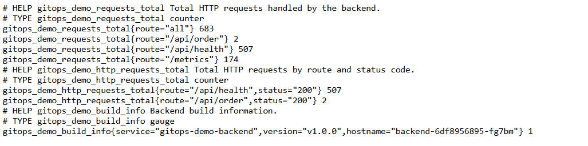

This screenshot proves that the backend exposes Prometheus-format metrics.

Important metrics:

```text
gitops_demo_requests_total
gitops_demo_http_requests_total
gitops_demo_build_info
```

The challenge uses `gitops_demo_http_requests_total` to calculate the backend error rate.

## 7. Prometheus Query


This screenshot proves that Prometheus can scrape and query backend metrics.

Main metric:

```promql
gitops_demo_http_requests_total
```

The SLO/error-rate query is based on:

```promql
(sum(increase(gitops_demo_http_requests_total{namespace="demo",route="/api/order",status=~"5.."}[1m])) or vector(0))
/
clamp_min((sum(increase(gitops_demo_http_requests_total{namespace="demo",route="/api/order"}[1m])) or vector(0)), 1)
```

## 8. Prometheus Alert Rule


This screenshot proves that the SLO alert rule exists in Prometheus.

Alert name:

```text
BackendHighErrorRate
```

SLO rule:

```text
/api/order error rate must stay below 5%
```

The alert fires when the error rate is greater than `0.05` for `1m`.

## 9. Good Canary Release

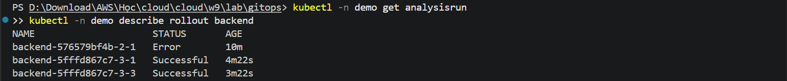

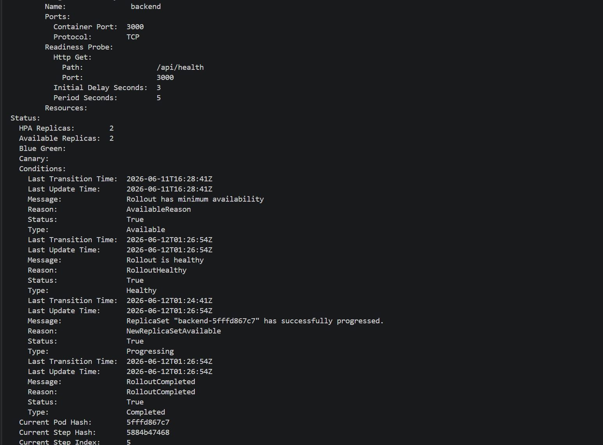
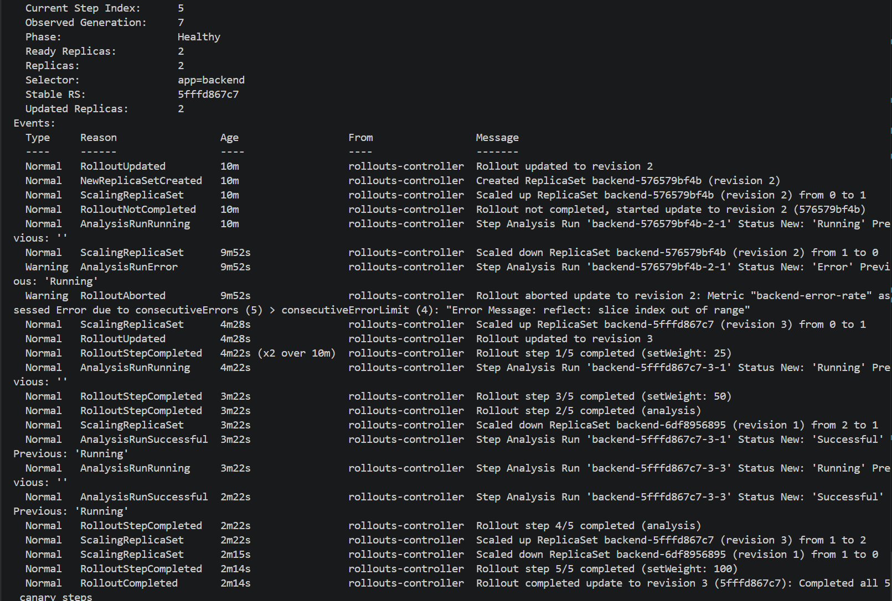

These screenshots prove that a healthy backend release passes canary analysis.

Expected result:

```text
AnalysisRun Successful
Rollout Healthy
RolloutCompleted
Stable ReplicaSet updated to the new version
```

This happens when the backend is configured with:

```yaml
ERROR_RATE: "0"
```

## 10. Bad Canary Auto-Abort

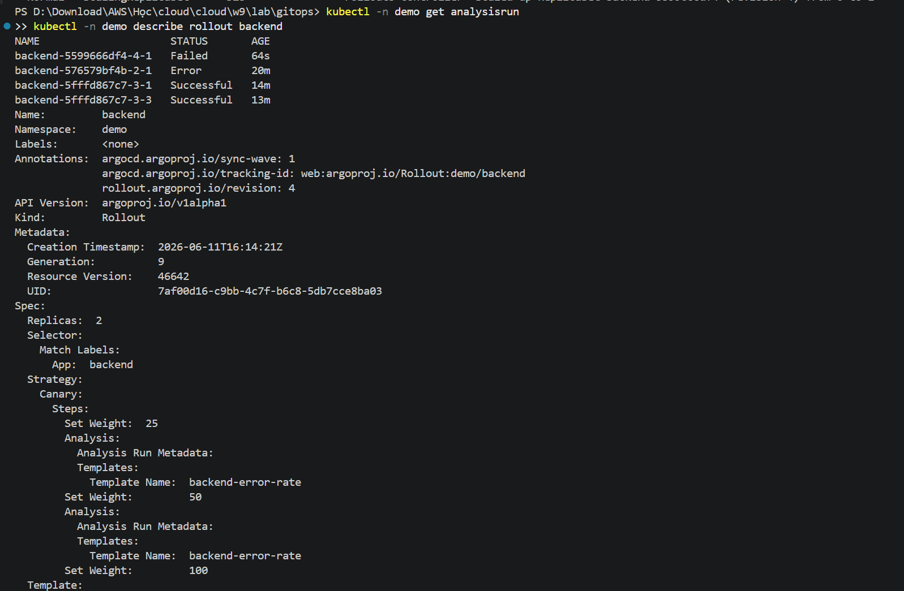
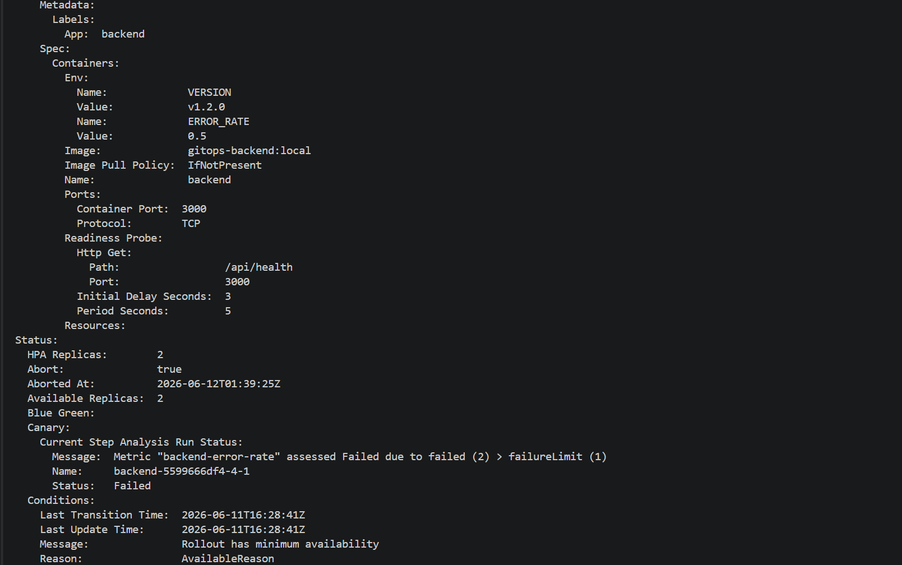
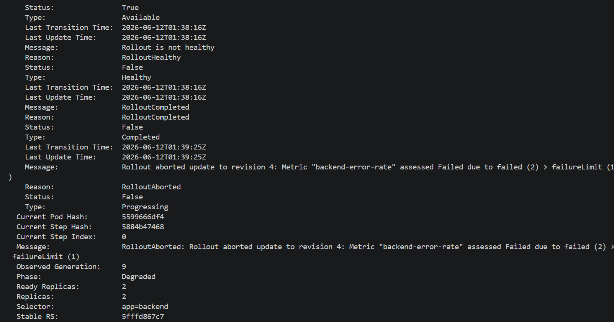

These screenshots prove that a bad backend release is automatically aborted.

Expected result:

```text
AnalysisRun Failed
RolloutAborted
Rollout Phase: Degraded
Stable ReplicaSet remains on the previous healthy version
```

This happens when the backend is configured with:

```yaml
ERROR_RATE: "0.5"
```

The bad version generates too many HTTP 500 responses, causing the Prometheus error-rate query to exceed the SLO threshold.

## 11. Git Revert Rollback

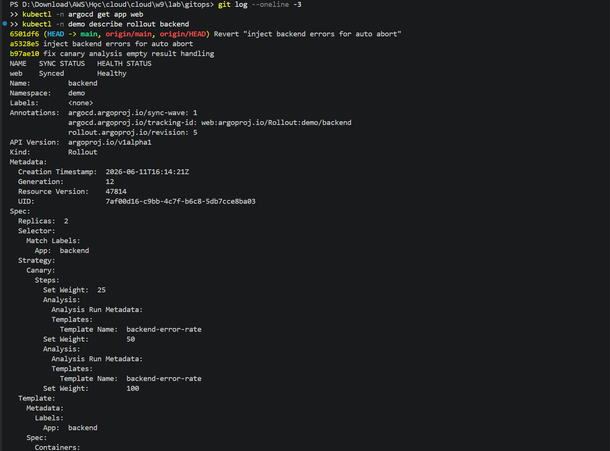

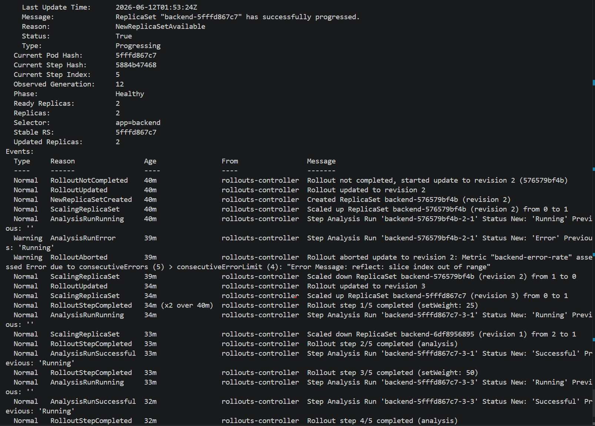


These screenshots prove that rollback is done through Git.

Rollback command pattern:

```powershell
git log --oneline
git revert <bad-commit-id> --no-edit
git push
```

After the revert is pushed, ArgoCD syncs the cluster back to the desired state from Git.

## 12. Alert Firing and Email Received


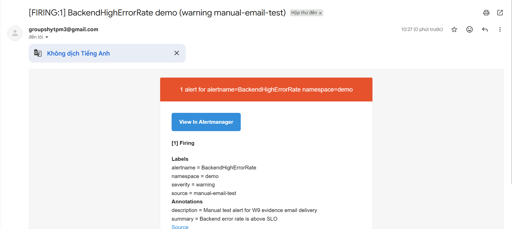

These screenshots prove that:

- `BackendHighErrorRate` reached the firing state.
- Alertmanager routed the alert to the email receiver.
- The alert email was received successfully.

The email receiver is configured in:

```text
cloud/w9/lab/gitops/argocd/apps/kube-prometheus-stack.yaml
```

The SMTP password is stored in a Kubernetes Secret and is not committed to Git.

## 13. Final Healthy State

After demonstrating the bad canary and email alert, the backend was restored to a healthy configuration:

```yaml
VERSION: "v1.8.0"
ERROR_RATE: "0"
```

Final verification commands:

```powershell
kubectl -n argocd get app web
kubectl -n demo get rollout backend
kubectl -n demo describe rollout backend
```

Expected final state:

```text
web    Synced    Healthy
backend Phase: Healthy
Stable RS: 66dd8ffb9f
```

Optional screenshot name if included later:

```text
evidence/13-final-web-synced-healthy.png
```

## Verification Commands

Use these commands to reproduce the evidence:

```powershell
kubectl -n argocd get applications
kubectl -n monitoring get pods
kubectl -n argo-rollouts get pods
kubectl -n demo get rollouts.argoproj.io,svc,servicemonitor,prometheusrule,analysistemplate,pods
kubectl -n demo get analysisrun
kubectl -n demo describe rollout backend
kubectl -n monitoring get secret alertmanager-smtp
```

## Security Note

Do not commit the real SMTP secret file:

```text
cloud/w9/lab/gitops/k8s/alertmanager-smtp-secret.yaml
```

Only the example file should be committed:

```text
cloud/w9/lab/gitops/k8s/alertmanager-smtp-secret.example.yaml
```

The example file must keep a placeholder value:

```yaml
smtp-password: REPLACE_WITH_GMAIL_APP_PASSWORD
```

## Summary

This evidence set demonstrates the full W9 challenge flow:

```text
Git change
  -> ArgoCD sync
  -> Rollout canary
  -> Prometheus metric analysis
  -> good version promoted
  -> bad version auto-aborted
  -> Prometheus alert fired
  -> Alertmanager sent email
  -> rollback performed through Git
```

